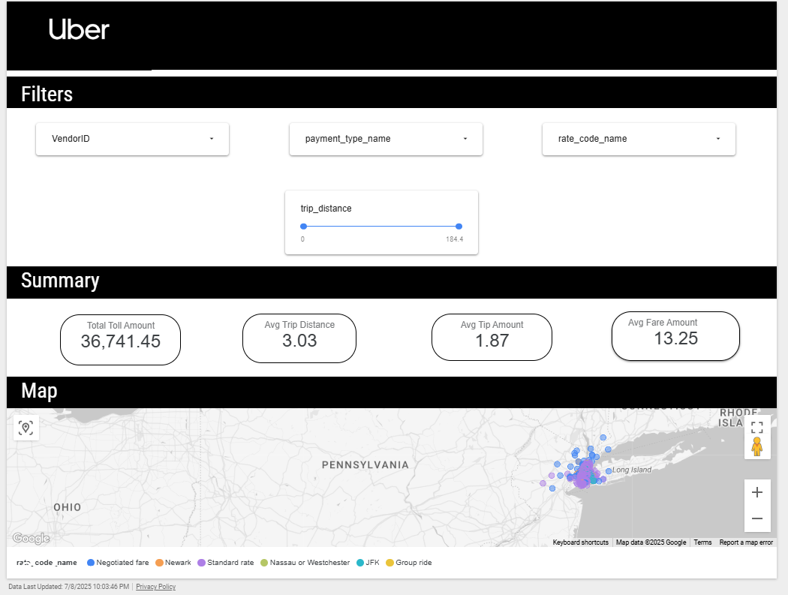

# 🧠 Modern Data Pipeline with Mage.ai, Google Cloud, BigQuery & Looker

A complete end-to-end data engineering project that builds a modern ELT pipeline using Mage.ai, hosted on a Google Cloud VM, with data warehousing in BigQuery, exploratory data analysis in Python, and dashboarding in Looker.

---

## 🚀 Project Overview

This project demonstrates how to set up and run a modern data pipeline using open-source and cloud-native tools:

- Mage.ai is used for ingestion, transformation, and orchestration.
- The server runs on a Google Cloud virtual machine.
- Data is transformed and loaded into BigQuery.
- A Looker dashboard visualizes the final output for stakeholders.
- EDA and data profiling are done in Python using Jupyter Notebooks.

---

## 🛠️ Tech Stack

| Tool            | Purpose                                  |
|-----------------|------------------------------------------|
| **Mage.ai**     | Orchestration & Data Pipelines           |
| **Google Cloud**| Hosting Mage server (Compute Engine VM)  |
| **BigQuery**    | Cloud Data Warehouse                     |
| **Python (Pandas)**| Exploratory Data Analysis             |
| **Looker Studio**| Interactive Dashboard                   |
| **Jupyter**     | EDA Notebooks                            |

---

## 🗂️ Project Structure

```
modern-data-pipeline-mage-gcp/
│
├── README.md                        # This file
├── mage_files/                   # Mage pipeline project
├── eda/
│   └── eda_analysis.ipynb          
├── looker_dashboard/
│   └── dashboard_screenshot.png    # Optional: Screenshot of Looker dashboard
├── data_samples/
│   └── sample_data.csv             # Optional: Raw or processed data 

```

---

## 🧪 Features

- ✅ Scheduled and triggered pipelines in Mage
- ✅ EDA performed in Python and Jupyter
- ✅ Seamless integration with Google Cloud and BigQuery
- ✅ Final output tables ready for analytics in Looker
- ✅ Modular and cloud-deployable architecture

---


## 📈 Dashboard




---

## ✅ Outcomes

- Learned to build a modular, scalable data pipeline using Mage.ai
- Automated data ingestion and transformation
- Cleanly deployed pipeline outputs to BigQuery
- Built stakeholder-facing visuals in Looker

---

## 📬 Let's Connect

Dream Johnson 
[LinkedIn]([https://linkedin.com/in/yourprofile](https://www.linkedin.com/in/dream-johnson-bb30a4210/)) • [GitHub]([https://github.com/your-username](https://github.com/Dream-Johnson)) 

---

